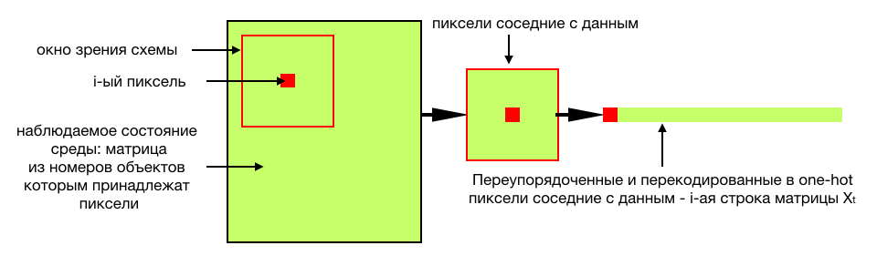
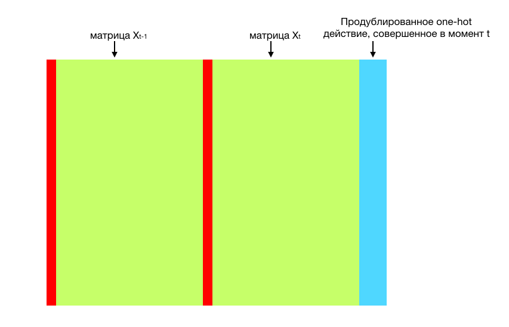
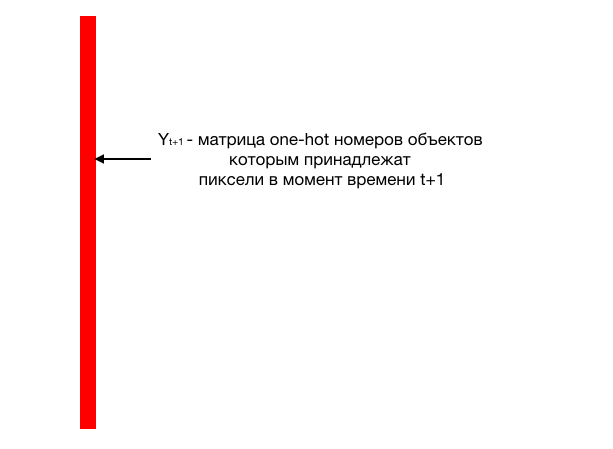

### Получение данных и препроцессинг данных из среды:
1. Входные данные - картинка, полученная из среды с $M$ типами различных объектов в момент времени $t$
2. Каждому пикселю поставим в соответствия тип объекта, частью которого он является

3. Сконкатенирусем матрицы $$X_t$$ и $X_{t-1}$ и добавим к каждой строке индекс текущего действия и обозначим за $X^{transformed}_t$ полученную матрицу

4. Выполним запланированное действие и получим результат из среды 

### Добавление данных в память модели:
1. Добавим в 
 уникальные пары (строка матрицы 
,
)

2. Итого 
 
